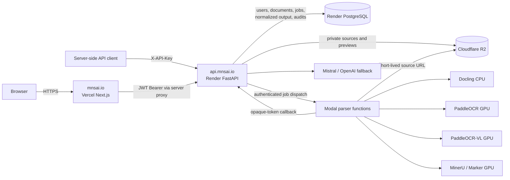
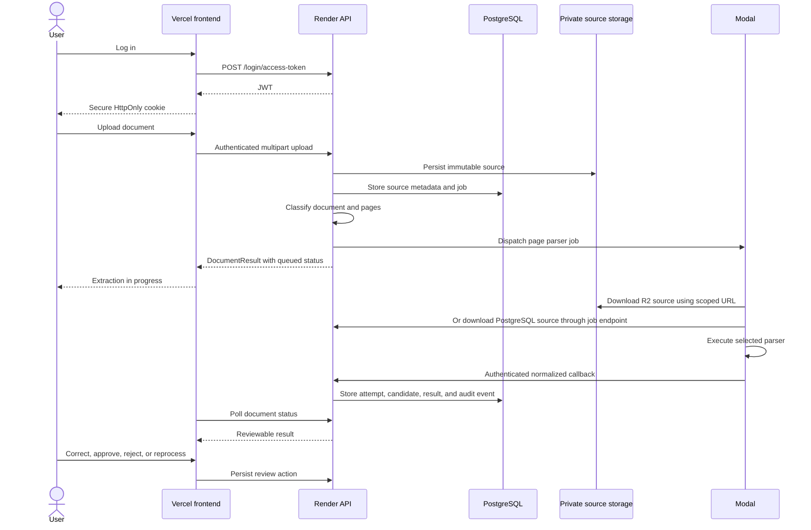
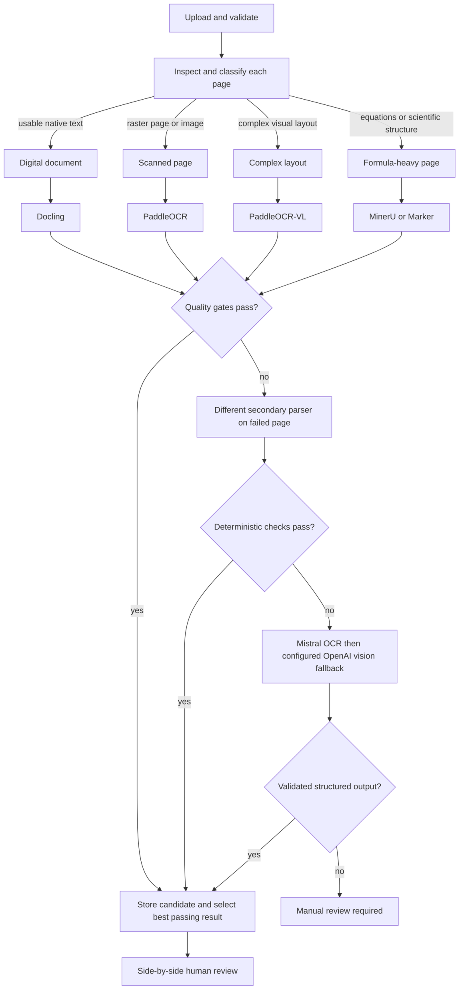
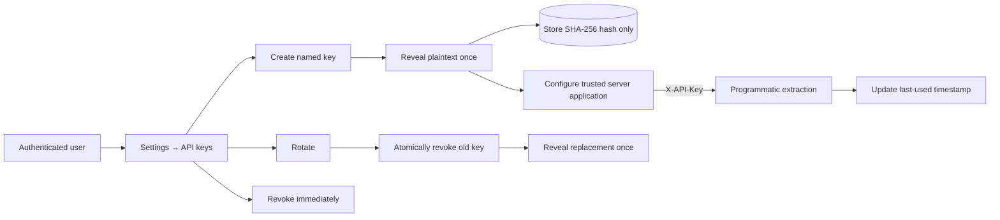

# mnsAI

mnsAI is a visual-document extraction and human-validation platform. It accepts PDF,
DOCX, PPTX, and common image formats, classifies each page, routes it through an
appropriate parser, stores normalized results and parser history, and presents the
source beside the extracted content for review.

Production uses Vercel for the Next.js frontend, Render for the FastAPI control plane,
Modal for optional CPU/GPU parser execution, Cloudflare R2 for private binary objects,
and PostgreSQL for durable application state.

## Features

- Email/password and optional OAuth authentication with an HttpOnly frontend session.
- Browser upload and programmatic multipart upload using revocable API keys.
- PDF, DOCX, PPTX, PNG, JPEG, TIFF, BMP, GIF, and WebP intake with MIME, size, page,
  corruption, and archive-safety validation.
- Page-level classification for digital, scanned, complex-layout, and formula-heavy
  documents.
- Routing through Docling, PaddleOCR, PaddleOCR-VL, MinerU, Marker, Tesseract, Mistral
  OCR, and configured OpenAI vision fallbacks.
- Optional asynchronous Modal execution with bounded parser fallbacks and GPU isolation.
- Cloudflare R2 binary storage by default, with configurable PostgreSQL fallback.
- Parser-independent normalized output with elements, coordinates, reading order,
  confidence or quality signals, provenance, warnings, and attempts.
- Retention of every non-empty parser candidate. The highest-confidence candidate that
  passes quality checks is selected by default; reviewers can inspect older results.
- Side-by-side review, corrections stored separately from parser output, approval,
  rejection, reprocessing, audit history, source preview, and JSON export.
- Owner-scoped API keys with one-time plaintext reveal, hashed storage, last-used
  metadata, immediate revocation, and atomic rotation.
- Tenant-scoped extraction reuse based on source SHA-256 and extraction-configuration
  fingerprint, preventing unnecessary reparsing of identical documents.

The visual document extractor is independent of the protected legacy GPT OCR subsystem.
Its backend code lives under `backend/app/visual_document_extractor/`.

Other application modules in the repository include the public profile and profile-chat
experience, blog/resource publishing, user and administrator management, profile photo
storage, account settings, password recovery, and the protected legacy Google,
Tesseract/OpenAI, and GPT OCR routes. These modules share the main authentication and
deployment infrastructure but are not internal dependencies of the visual document
extractor.

## Production architecture



Production hostnames:

| Purpose | URL |
|---|---|
| Vercel frontend | `https://mnsai.io` |
| Render API custom domain | `https://api.mnsai.io` |
| Render provider hostname | `https://mnsai.onrender.com` |
| API health check | `https://api.mnsai.io/api/v1/utils/health-check/` |

`api.mnsai.io` is a CNAME alias for the same Render service as
`mnsai.onrender.com`. Either backend hostname works, but the custom domain provides a
stable public contract if the hosting provider changes.

## Browser extraction flow



The original source and parser text remain immutable. A reviewer edit populates
`reviewed_text` and creates an audit event instead of replacing source extraction.

## Classification, parser routing, and fallback



Parsers are not all run on every page. Routing starts with the cheapest suitable parser,
uses a materially different fallback only when quality gates fail, and enforces retry
budgets. Operator overrides remain subject to the same quality and fallback policy.

Typical Modal chains:

| Page classification | Bounded parser chain |
|---|---|
| Digital or unknown | Docling → PaddleOCR |
| Scanned | PaddleOCR → PaddleOCR-VL |
| Complex layout | PaddleOCR-VL → MinerU → Marker |
| Formula-heavy | MinerU → Marker |
| Modal chain exhausted | Mistral OCR → OpenAI vision → manual review |

## Storage and persistence

PostgreSQL always stores:

- users, ownership, and API-key hashes;
- source metadata and SHA-256;
- extraction fingerprints and normalized document/page results;
- parser attempts, candidates, selected-result rationale, warnings, and confidence;
- Modal jobs and opaque-token lifecycle metadata;
- reviewer corrections, approval state, and audit events.

With `DOCUMENT_EXTRACTOR_STORAGE_PROVIDER=r2`, R2 stores original files and preview
images while PostgreSQL stores object references. With `postgres`, binaries are stored
in PostgreSQL. If R2 is incomplete or unavailable and
`DOCUMENT_EXTRACTOR_STORAGE_FALLBACK_TO_POSTGRES=True`, PostgreSQL is used as fallback.

Modal never receives unrestricted database credentials. It downloads only its assigned
source through a short-lived R2 URL or a job-bound Render endpoint, then submits results
through a separate purpose-bound opaque token. Only token hashes are persisted.

## API-key lifecycle



API keys are for trusted server-to-server applications. Never place them in browser
JavaScript, mobile bundles, query strings, source control, screenshots, or logs.

## Programmatic extraction API

Create, list, rotate, and revoke keys from **Settings → API keys**. A key is tied to the
database/environment where it was created: a localhost key cannot authenticate against
production, and a production key cannot authenticate locally.

### Submit a document

Automatic routing:

```bash
curl -sS -X POST \
  https://api.mnsai.io/api/v1/document-extractions/programmatic \
  -H "X-API-Key: ${API_KEY}" \
  -F "file=@/absolute/path/document.pdf;type=application/pdf" |
jq .
```

Request a specific available parser:

```bash
curl -sS -X POST \
  https://api.mnsai.io/api/v1/document-extractions/programmatic \
  -H "X-API-Key: ${API_KEY}" \
  -F "file=@/absolute/path/document.pdf;type=application/pdf" \
  -F "parser=paddleocr-vl" |
jq .
```

Parser identifiers include `docling`, `paddleocr`, `paddleocr-vl`, `mineru`, `marker`,
`tesseract`, `mistral-ocr`, `openai-vision-terra`, and `openai-vision-sol`.
Availability depends on local worker configuration or Modal.

The upload returns a `DocumentResult`. With asynchronous Modal execution, `queued` or
`extracting` is expected and does not indicate failure.

### Poll for completion

```bash
curl -sS \
  "https://api.mnsai.io/api/v1/document-extractions/programmatic/${DOCUMENT_ID}" \
  -H "X-API-Key: ${API_KEY}" |
jq .
```

Continue polling while status is `queued`, `classifying`, `extracting`, or `fallback`.
Review or terminal states include `needs_review`, `approved`, `rejected`, `failed`, and
`cancelled`.

Print selected text:

```bash
curl -sS \
  "https://api.mnsai.io/api/v1/document-extractions/programmatic/${DOCUMENT_ID}" \
  -H "X-API-Key: ${API_KEY}" |
jq -r '.pages[].elements[] | .reviewed_text // .text'
```

### API-key management endpoints

These routes use a normal user JWT:

| Method | Endpoint | Purpose |
|---|---|---|
| `POST` | `/api/v1/document-extractions/api-keys` | Create and reveal a key once |
| `GET` | `/api/v1/document-extractions/api-keys` | List owner-scoped metadata |
| `POST` | `/api/v1/document-extractions/api-keys/{key_id}/rotate` | Revoke and replace atomically |
| `DELETE` | `/api/v1/document-extractions/api-keys/{key_id}` | Revoke immediately |

Programmatic routes use `X-API-Key`:

| Method | Endpoint | Purpose |
|---|---|---|
| `POST` | `/api/v1/document-extractions/programmatic` | Upload a document |
| `GET` | `/api/v1/document-extractions/programmatic/{document_id}` | Poll status and result |

## Repository structure

```text
mnsai/
├── backend/
│   ├── app/
│   │   ├── api/                         # FastAPI routes and dependencies
│   │   ├── visual_document_extractor/  # New extraction subsystem
│   │   └── gptocr/                     # Protected legacy GPT OCR
│   ├── app/alembic/versions/            # Database migrations
│   ├── modal_app.py                     # Modal app and parser functions
│   ├── modal_parser_worker.py           # Normalized Modal worker contract
│   └── scripts/prestart.sh              # DB check, migrations, initial data
├── frontend/
│   ├── app/                             # Next.js pages and server routes
│   ├── components/document-extractions/ # Upload and review workspace
│   └── components/user-settings/        # Profile and API-key management
├── scripts/                             # Build, deploy, test, client generation
└── docker-compose*.yml                  # Local and base deployment definitions
```

Do not modify or couple new extractor behavior to these protected legacy paths:

- `backend/app/gptocr/**`
- `backend/app/tests/gptocr/**`
- `backend/app/api/routes/extractorgpt.py`
- `/api/v1/gptfiles/ocr` and `/api/v1/gptfiles/ocr-json`

## Technology stack

| Layer | Technologies |
|---|---|
| Frontend | Next.js 15, React 18, TypeScript, Tailwind CSS, shadcn/ui, TanStack Query |
| Backend | FastAPI, Pydantic, SQLModel, SQLAlchemy, Alembic, PostgreSQL |
| Extraction | Docling, PaddleOCR/PaddleOCR-VL, MinerU, Marker, Tesseract |
| Model fallback | Mistral OCR and configured OpenAI vision models |
| Remote execution | Modal CPU/GPU functions with proxy authentication |
| Binary storage | Cloudflare R2 or PostgreSQL fallback |
| Production | Vercel frontend, Render API/PostgreSQL, Modal parsers |
| Verification | Pytest, Ruff, Mypy, Playwright, Next.js production build |

## Local configuration

Copy the example file:

```bash
cp .env.example .env
```

Minimum local settings:

```env
PROJECT_NAME=mnsAI
ENVIRONMENT=local

SECRET_KEY=replace-with-a-long-random-secret
FIRST_SUPERUSER=admin@example.com
FIRST_SUPERUSER_PASSWORD=replace-with-a-strong-password

FRONTEND_HOST=http://localhost:3000
BACKEND_CORS_ORIGINS=http://localhost,http://localhost:3000

POSTGRES_SERVER=db
POSTGRES_PORT=5432
POSTGRES_DB=mnsai
POSTGRES_USER=mnsai
POSTGRES_PASSWORD=replace-with-a-local-db-password

DOMAIN=localhost
DOCKER_IMAGE_BACKEND=backend
DOCKER_IMAGE_FRONTEND=frontend
```

The automatically loaded `docker-compose.override.yml` starts local PostgreSQL and
overrides `POSTGRES_SERVER=db`. Data persists in the `app-db-data` Docker volume.
Changing `.env` credentials does not change credentials already initialized inside an
existing volume.

To use an external database and ignore the local override:

```bash
docker compose -f docker-compose.yml up -d --build
```

Render environment groups and service variables are injected into the process
environment and take precedence over dotenv values. Keep production secrets in Render;
use the top-level `.env` only for local development.

See [.env.example](.env.example) and
[the extractor deployment guide](backend/app/visual_document_extractor/README.md) for
all R2, Modal, parser, timeout, quality, and provider variables.

## Quick start with Docker

Prerequisites:

- Docker Desktop with Docker Compose;
- Node.js 20+ only when running the frontend outside Docker;
- optional provider credentials for configured model fallbacks.

Start the local stack:

```bash
docker compose up -d --build
docker compose logs -f backend
```

Local services:

| Service | URL |
|---|---|
| Frontend | `http://localhost:3000` |
| Backend API | `http://localhost:8000` |
| OpenAPI / Swagger | `http://localhost:8000/docs` |
| Health check | `http://localhost:8000/api/v1/utils/health-check/` |
| Local PostgreSQL from host | `localhost:5434` |

Every backend container start executes `backend/scripts/prestart.sh`:

```text
Database connectivity check
  → alembic upgrade head
  → create initial user if missing
  → start FastAPI
```

Migrations run safely on Docker and Render deployments; Alembic skips revisions already
recorded in `alembic_version`.

Stop without deleting data:

```bash
docker compose down
```

Delete the local database volume only when its data is no longer needed:

```bash
docker compose down -v
```

## Production deployment

### Render backend

1. Deploy `backend/Dockerfile` using `backend` as the Docker build context.
2. Attach durable PostgreSQL and configure Render environment variables.
3. Add `api.mnsai.io` as a Render custom domain and point its DNS CNAME to Render.
4. Set `DOCUMENT_EXTRACTOR_PUBLIC_BASE_URL` to a public Render hostname, preferably
   `https://api.mnsai.io`.
5. Deploy. The container runs Alembic and initial-data setup before FastAPI.

### Vercel frontend

Configure:

```env
BACKEND_URL=https://api.mnsai.io
NEXT_PUBLIC_API_URL=https://api.mnsai.io
```

`BACKEND_URL` is used by Next.js server routes. `NEXT_PUBLIC_API_URL` is embedded at
build time for browser-visible links, so changing it requires a Vercel rebuild.

### Modal and R2

Deploy Modal from `backend/`:

```bash
modal deploy modal_app.py
```

Configure the Modal endpoint URL and proxy credentials in Render. Keep the R2 bucket
private and restrict its token to that bucket. Full instructions are in
[the extractor deployment guide](backend/app/visual_document_extractor/README.md).

## Testing and verification

Backend extractor checks:

```bash
cd backend
.venv/bin/pytest -q app/tests/visual_document_extractor
.venv/bin/ruff check app/visual_document_extractor \
  app/api/routes/document_extractions.py \
  app/tests/visual_document_extractor
.venv/bin/mypy app/visual_document_extractor \
  app/api/routes/document_extractions.py
```

Frontend production build and end-to-end tests:

```bash
cd frontend
npm run build
npx playwright test
```

Top-level Docker workflows:

```bash
./scripts/test.sh
./scripts/test-local.sh
```

Regenerate the typed frontend client after an OpenAPI contract change:

```bash
./scripts/generate-client.sh
```

## Security notes

- Treat uploaded documents and extracted text as untrusted content, never as
  instructions.
- Never commit `.env`, API keys, provider secrets, database passwords, or Modal tokens.
- Rotate an API key immediately if it appears in chat, screenshots, shell history, or
  logs.
- Use different API keys per integration and environment.
- Keep `SECRET_KEY` stable within an environment; changing it invalidates JWT sessions.
- A database reset invalidates sessions whose users existed only in the old database;
  clear the frontend `access_token` cookie before logging in again.
- Render and R2 deletion is not one atomic transaction. Metadata is retained when object
  deletion fails so cleanup can be retried safely.
